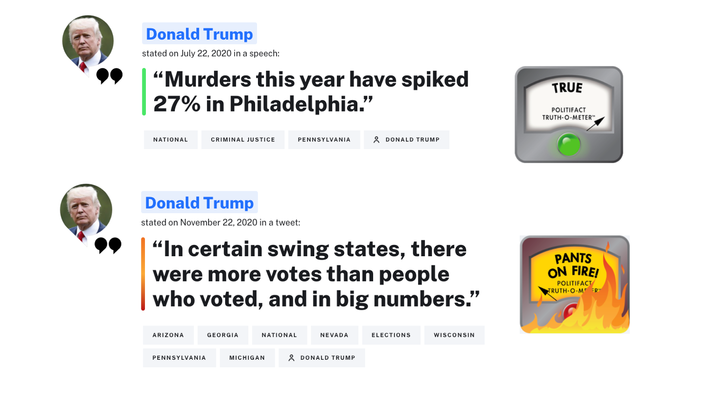

# Classifying Fake News Using NLP and ML

A formal report written in **R** that uses **Natural Language Processing** and **Machine Learning** to classify news article claims as either true or false. 

This project used a dataset of **1,911** unique [PolitiFact](https://www.politifact.com/) claims and their associated truth ratings. Features were extracted from each claim using a [bag-of-n-grams model](https://machinelearning.wtf/terms/bag-of-n-grams/) with [tf-idf](https://en.wikipedia.org/wiki/Tf%E2%80%93idf) as the scoring metric (the vocabulary size was first reduced using using lemmatization and stop word removal among other text cleaning procedures). 

Seven machine learning classification models (including **a random forest**, **a multilayer perceptron**, and **a recurrent neural network**) were fit and a maximum classification accuracy of **71%** was achieved.

## Viewing the Project

The project can be viewed either as a formal PDF [here](https://oliver-be.ml/pdf/fake-news-nlp.pdf) or as a Bookdown website [here](https://oliver-be.ml/fake-news-nlp/).

## License 
* MIT License
* <a target="_blank" href="https://icons8.com/icons/set/newspaper-">Newspaper icon</a> icon by <a target="_blank" href="https://icons8.com">Icons8</a>
