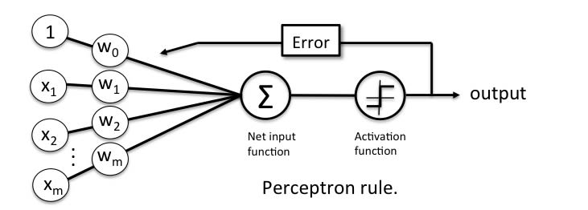

```{r setup, include = FALSE}
library(tidyverse)
library(mosaic)
library(mdsr)
library(knitr) 
library(kableExtra)
library(reshape2)
library(ggplot2) 
library(e1071)  
library(randomForest)
library(tm) 
library(textstem)
library(keras)
library(tensorflow)
library(glmnet)
library(text2vec)
library(caret) 
knitr::opts_chunk$set(fig.pos = "H", out.extra = "")
```

# Preface {-}

This project was submitted to the Department of Mathematics and Statistics, Amherst College in partial fulfillment of the requirements for the degree of Bachelor of Arts. 

**Abstract:**

Natural Language Processing (NLP) is the process of helping computers understand and interpret human language (which is hard to do without an inherent knowledge of tone, connotation, sarcasm, etc.). "Fake news" and the validity of news articles, Tweets, and more are at the forefront of national conversations around free speech and the spread of misinformation. This project uses NLP to classify news articles as either real or fake through the use of lemmatization, stop words, bag-of-words feature extraction, a multilayer perceptron neural network, a recurrent neural network, and other machine learning models. 
  
**Keywords:**

* Natural Language Processing 
* Machine Learning
* Fake News
* Lemmatization
* Bag-of-words model
* Deep Learning
* Recurrent Neural Network
  
```{r message=FALSE, warning=FALSE, echo=FALSE, cache=TRUE, results='hide'}
# this chunk is needed to run all of the data wrangling ahead of time so that
# EDA figures can be generated
politifact_df_raw <- read_csv("../data-raw/politifact_phase2_clean_2018_7_3.csv")  

# clean up raw data
politifact_df_cleaned <- politifact_df_raw %>% 
  # get rid of duplicate URLs (reasoning for this is discussed in limitations)
  distinct(politifact_url_phase1, .keep_all = TRUE) %>%  
  # keep only the two targets we care about 
  filter(fact_tag_phase1 == "True" | fact_tag_phase1 == "Pants on Fire!") %>%
  # change desired targets to categorical and numerical
  mutate(targets_numerical = as.numeric(ifelse(fact_tag_phase1 == "True", 1, 0)),
         targets_categorical = as.factor(ifelse(fact_tag_phase1 == "True", 1, 0))) %>%
  # rename the article claim variable
  rename(article_claim = article_claim_phase1) %>% 
  # only keep the variables we care about
  select(article_claim, targets_numerical, targets_categorical)

# add an id 
politifact_df_cleaned$article_id <- seq.int(nrow(politifact_df_cleaned)) 
 
# a function to perform text cleaning
clean_text <- function(input_text) {
  # remove punctuation
  output_text <- removePunctuation(input_text) %>% 
    # make all letters lowercase
    tolower() %>% 
    # remove a custom list of English stop words (from the `tm` package)
    removeWords(stopwords("en")) %>% 
    # lemmatize the words in the text 
    lemmatize_strings() %>% 
    # remove any numbers in the text
    removeNumbers() %>% 
    # get rid of any extra white space
    stripWhitespace()
  
  return(output_text)
}
 
# clean up the article claim text, create a final dataframe
politifact_df_final <- politifact_df_cleaned %>% 
  mutate(article_text = clean_text(article_claim)) %>% 
  select(article_id, article_text, targets_numerical, targets_categorical)

# set the seed to ensure reproducibility
set.seed(2)

# the number of rows in our final data frame 
num_politifact_rows <- nrow(politifact_df_final)

# get random row numbers from our data frame (80% of all possible row numbers
# will be stored in `random_row_numbers` since we have an 80/20 split)
random_row_numbers <- sample(1:num_politifact_rows, 0.8 * num_politifact_rows)

# use our randomly generated row numbers to select 80% of our data for training
politifact_df_train  <- politifact_df_final[random_row_numbers, ] %>% 
  # sort by article id
  arrange(article_id)
# and use the remaining 20% of our data for testing
politifact_df_test   <- politifact_df_final[-random_row_numbers, ] %>% 
   arrange(article_id)

# keep track of our target variables in a list 
train_targets_numerical <- politifact_df_train$targets_numerical
train_targets_categorical <- politifact_df_train$targets_categorical

test_targets_numerical <- politifact_df_test$targets_numerical
test_targets_categorical <- politifact_df_test$targets_categorical

# tokenize the text into individual words
tokenizer_train <- word_tokenizer(politifact_df_train$article_text) %>% 
  itoken(ids = politifact_df_train$article_id, progressbar = FALSE)

# this test tokenizer will be used later
tokenizer_test <- word_tokenizer(politifact_df_test$article_text) %>% 
  itoken(ids = politifact_df_test$article_id, progressbar = FALSE)
         
# create our vocabulary with the training data
vocabulary <- create_vocabulary(tokenizer_train, ngram = c(1L, 3L))
# we observe 28678 unique terms, this is too large

# prune our vocabulary to only include terms used at least 2 times
pruned_vocabulary <- prune_vocabulary(vocabulary, term_count_min = 5)
# we now observe 806 unique terms, which is more manageable

# create our training and testing DTMs using our tokenizers
vocabulary_vectorizer <- vocab_vectorizer(pruned_vocabulary) 

dtm_train <- create_dtm(tokenizer_train, vocabulary_vectorizer) 
dtm_test <- create_dtm(tokenizer_test, vocabulary_vectorizer)   
tfidf <- TfIdf$new()

# fit model to train data and transform train data with fitted model
dtm_train <-  fit_transform(dtm_train, tfidf)
dtm_test <-  fit_transform(dtm_test, tfidf)

# convert our DTMs to a matrix and data frame--different formats are needed
# for different models (`keras` only takes matrices for example)
dtm_train_matrix <- as.matrix(dtm_train)
dtm_test_matrix <- as.matrix(dtm_test)

dtm_train_df <- as.data.frame(dtm_train_matrix)
dtm_test_df <- as.data.frame(dtm_test_matrix)
```

# Introduction  

"Fake news" is a term that has risen to the forefront of the national conservation over the past few years. According to a 2019 Pew Research Center survey,^[@mitchellManyAmericansSay2019] Americans rate fake news as a larger problem than violent crime, climate change, and racism (among other categories). In addition—according to the same survey—68% of Americans say that fake news has a big impact on their confidence in government. At its core, fake news is simply defined as news stories that are false or fabricated. Fake news stories can be "propaganda that [are] intentionally designed to mislead the reader" or "clickbait" stories that are designed for "economic incentives."^[@desaiResearchGuidesFake]

Due to the issue of fake news, verifying the validity of news articles (fact-checking) has become an increasingly important job for news network. This can be seen in the last 2020 presidential debate between Joe Biden and Donald Trump, where multiple news sources (e.g. the New York Times^[@shearFactCheckingFinalPresidential2020]) reported on the validity of each candidate's claims. Websites such as Snopes^[@Snopes] and PolitiFact^[@PolitiFact] do this fact-checking on a daily basis. The dataset used in this project comes from the fact-checking website PolitiFact (see Section \@ref(data)).

However, fact-checking is not perfect. There exist limitations from fact-checking websites like PolitiFact, such as confirmation bias: "people may not be likely to fact-check a story that aligns with their pre-existing beliefs."^[@asrBigDataQuality2019] Additionally, manual fact-checking is a time-intensive process. Thus, there is motivation to provide another source of fake news assessment: a statistical model that aims to predict fake news using Natural Language Processing. Designing a model that does so is the goal of this project.

# Background 

## Natural Language Processing

Natural Language Processing (NLP) is the process of helping computers understand and interpret human language (which is hard to do without an inherent knowledge of tone, connotation, sarcasm, etc.).^[@cybiantNaturalLanguageProcessing] NLP is important because it allows computers to read text (or listen to speech) and interpret what messages are being conveyed. It is used in tasks such as sentiment analysis, language translation, or—in the case of fake news—classification. 

NLP is advantageous because it is able to analyze language-based data "in a consistent and unbiased way."^[@WhatNaturalLanguage] Note that the notion of algorithmic bias^[Algorithmic bias describes systematic and repeatable errors in a computer system that create unfair outcomes, such as privileging one arbitrary group of users over others. @AlgorithmicBias2020] is a complex topic that is beyond the scope of this project. Thus, for the purposes of this project, the NLP used assumes unbiased classification. Assuming this sort of unbiased classification, using NLP to classify fake news is clearly beneficial.

In this project, NLP is used to extract features from a set of PolitiFact claims. Those features, and the associated truth rating of each claim, are then used to fit multiple machine learning algorithms with the end goal of classifying fake news with a high accuracy. In order to extract features from text, lemmatization and stop words are first used to reduce the size of the overall vocabulary. Then, the bag-of-words model, which is represented by a document-term matrix (DTM), is used to create a matrix of features. 

### Reducing a Vocabulary with Lemmatization and Stop Words

In NLP, a text corpus refers to the collection of text documents being used. In the context of this project, the text corpus is all of the PolitiFact claims used. A vocabulary, in NLP, is then the set of unique words used in a text corpus.^[@VocabularyNaturalLanguage] When extracting features from text in NLP, a common problem is that the vocabulary is too large. This is due to the fact that many words that have very similar meanings (such as "cook", "cooks", and "cooking") are each included as a separate word in the vocabulary. In addition, many words that (in most contexts) don't carry meaning—such as "and", "of", and "the"—significantly increase the vocabulary length. To combat this, stemming/lemmatization and the removal of stop words can be used.

Stemming is a process used in NLP that removes the ends of words in order to get rid of words that have derivational affixes.^[@StemmingLemmatization] There are standard stemming libraries that remove endings of words such as "-ing", "-es", and "-ed". In addition, users can create their own custom functions to remove endings of words that are not included in a stemming library. In stemming, the words "dog", "dogs", and "dog’s" would all be cut down to the word "dog". This helps to reduce the number of words that are counted in a document. However, a word such as "doggie" would likely be missed by stemming (unless a custom function had "-gie" set to be removed). Because of such exceptions, lemmatization is used in this project instead of stemming.

Lemmatization has the same end goal of stemming, but uses a vocabulary of base words (lemmas) that words in a document are matched to (and then changed to).^[@StemmingLemmatization] An example of when lemmatization is preferable over stemming is with a word such as "better", which has "good" as its lemma. This sort of word would be missed with stemming, but caught with lemmatization (which would have a dictionary matching these two words together). Another example of when lemmatization is preferable over stemming is with the would "caring". Lemmatizing "caring" gives us "care", but stemming would likely give you "car" (since a stemming function would erroneously try to remove just the "-ing"). Lemmatization is useful since it is able to reduce the vocabulary size by condensing words that have different textual representations (but are the same words otherwise) into just one word in a vocabulary. 

Stop word removal is the process of removing specified words from a vocabulary with the goal of reducing the vocabulary size. Stop words are words such as "and", "the", and "as" that and add noise to NLP feature extraction and don't provide any interesting insights. Custom stop words (depending on the context of the problem at hand) can also be added to a stop words dictionary. 

A full working example of how to clean a single text entry to do the above discussed lemmatization and stop word removal (as well as some other standard text cleaning operations) can be seen in the code chunk below. A very similar text cleaning function is used to clean the PolitiFact claims in this project (and can be seen in Section \@ref(appendix-data)).

```{r}
# this is our text input 
trump_claim_raw <- "'Trump approval rating    better than Obama  and Reagan at 
            same point in their presidencies.'"  

# a function to perform text cleaning
clean_text <- function(input_text) {
  # create a list of all of the stop words we want to remove from our corpus
  # note that `stopwords("en")` is a pre-defined list of stop words, but we
  # can also add custom stop words (here Obama and Reagan are added)
  all_stops <- c("Obama", "Reagan", stopwords("en"))

  # remove any punctuation from the text
  output_text <- removePunctuation(input_text) %>% 
    # remove our custom list of stop words
    removeWords(all_stops) %>% 
    # make all letters lowercase
    tolower() %>% 
    # lemmatize the words in the text 
    lemmatize_strings() %>% 
    # remove any numbers in the text
    removeNumbers() %>% 
    # get rid of any extra white space
    stripWhitespace()
  
  return(output_text)
}

# apply the text cleaning function
trump_claim_clean <- clean_text(trump_claim_raw)
# note how "better" becomes good and "presidencies" becomes "presidency"
# also notice that "Obama" and "Reagan" were removed
trump_claim_clean
```

### Bag-of-Words Model for Feature Extraction {#bag-of-words}
\label{sec:bag-of-words}

Once a vocabulary has been created—and its size reduced—features can be extracted using the bag-of-words model. The bag-of-words model is a way to extract features from text by describing the occurrence of each word in the vocabulary within a single document (and discarding any information about the order of those words).^[@brownleeGentleIntroductionBagofWords2017] Each document in a text corpus (each PolitiFact claim) consists of a score for each word in the vocabulary. In the most simple case, that score is simply the number of times each word in a document occurs in the vocabulary. Note that there are many alternative scoring metrics here, one such being the term frequency-inverse document frequency (tf-idf).^[Tf-idf is used to increase the weight of terms which are specific to a single document (or handful of documents) and decrease the weight for terms used in many documents. @AnalyzingTextsText2vec] (Tf-idf is used as the scoring metric in this project.)

In practice, bag-of-words feature extraction is represented by a document-term matrix (DTM). A DTM is "a matrix that describes the frequency of terms that occur in a collection of documents" where "rows correspond to documents in the collection and columns correspond to terms."^[@DocumenttermMatrix2020] To best illustrate this, an example of creating a DTM (using term frequency to fill in cell values) with the `text2vec` package can be seen in the code chunk below. Here, we can see a basic example of how to extract features from an initially uncleaned text corpus by first reducing the vocabulary size and then creating a DTM. The resulting DTM can be seen in Table \@ref(tab:sample-dtm-table).

```{r} 
# our initial text corpus
car_text <- rbind.data.frame("Bob really likes cars", 
                  "Sally really, really does not like cars",
                  "Sally only likes 3 types of cars")

# add unique document ids 
car_text <- cbind(car_text, c(1, 2, 3))
colnames(car_text) <- c("text", "id")

# clean the text using the same cleaning function from before
# in order to reduce the vocabulary size
car_text <- car_text %>% 
  mutate(cleaned_text = clean_text(text))

# tokenize the text into individual words 
tokenizer_car <- word_tokenizer(car_text$cleaned_text) %>% 
  itoken(ids = car_text$id, progressbar = FALSE)
         
# create our vocabulary using the tokenized words
car_vocabulary <- create_vocabulary(tokenizer_car) 

# create a tokenizer using each word in the vocabulary
vocabulary_vectorizer <- vocab_vectorizer(car_vocabulary) 

# finally, create our DTM
car_dtm <- create_dtm(tokenizer_car, vocabulary_vectorizer)
# convert the DTM to a matrix so that we can print it
car_dtm <- as.matrix(car_dtm)
```

```{r sample-dtm-table, echo=FALSE}
knitr::kable(car_dtm, row.names = TRUE, format = "html",
             caption = "An example DTM using a term frequency
             scoring metric") # %>% 
  # kable_styling(latex_options = "hold_position")
```

In Table \@ref(tab:sample-dtm-table) we observe that the vocabulary in this example has been trimmed to six words. Words such as "does", "of", and "only" have been removed and words such as "likes" have been lemmatized to "like". Each row represents each of document and each column represents a word in the vocabulary. Each cell tells us how many times each vocabulary word appears in a specific document. For example, the first document has one occurrence of "really", the second document has two occurrences, and the third document has none.

## Deep Learning Models

### Multilayer Perceptrons

Deep learning is a subfield of machine learning that is concerned with artificial neural networks, which are algorithms inspired by the human brain. Neural networks—which is what deep learning models refer to—are beneficial because results tend to get better with more data and larger models (at the expense of computation and run-time). They are also able to "perform automatic feature extraction from raw data," which makes them well suited to NLP tasks.^[@brownleeWhatDeepLearning2019]

To understand how neural networks work we must first understand their building blocks, perceptrons. A perceptron is made up of four parts: input values, weights and bias, a net input function, and an activation function. This can be seen illustrated in Figure \@ref(fig:perceptron-ex).^[@WhatPerceptronSimplilearn]

```{r perceptron-ex, echo=FALSE, out.width="90%", fig.align="center", fig.cap="A diagram of a basic perceptron"}

```

The input values, represented by the first row of nodes in the above figure, are combined with the weight values in the second row of nodes (weight values are initially randomized). The perceptron then receives this net input and passes it to the net input function. This net input is passed to the activation function which decides (based on the net input) whether or not to generate a $+1$ or a $-1$. This generated output is then the predicted class label of the example. During the learning phase, the predicted class labels are used to calculate the error of each prediction and update the weights accordingly.^[@reginaoftechNeuralNetworksBasics2019]

When more than one perceptron is connected, stacked in several layers, a neural network is created. In their most basic form, neural networks consist of an input layer of features, a hidden layer, and an output layer. A multilayer perceptron (MLP) is a neural network with at least one hidden layer. Figure \@ref(fig:nn-ex) displays a MLP where each node in the input and hidden layer represent an individual perceptron.^[@PerceptronsMultiLayerPerceptrons] Each perceptron in each layer is connected to every other perceptron in the following layer with weighted edges. Because there can be a large number of nodes in each layer, a MLP can quickly become complex. In a similar way to individual perceptrons, output values are predicted by stepping through the neural network during the feedforward phase. Edge weights between neurons are then updated during training through a process called backpropagation.^["Backpropagation is an algorithm for supervised learning of artificial neural networks using gradient descent. Given an artificial neural network and an error function, the method calculates the gradient of the error function with respect to the neural network's weights." @Backpropagation] This feedforward and backpropogation process repeats for a user-defined number of times. Normally, when evaluating a neural network, you should repeat this process until the edge weights are able to maximize classification accuracy on a validation set.

```{r nn-ex, echo=FALSE, out.width="70%", fig.align="center", fig.cap="A diagram of a multilayer perceptron"}
knitr::include_graphics("images/neural-network-example.png")
```

Setting the number of hidden layers in a MLP (as well as the number of nodes in each hidden layer) is an issue of model tuning and can vary from model to model. However, there is rarely much practical need to have more than two hidden layers, and one is sufficient in most problems.^[@ModelSelectionHow] There is no rule for how many nodes each layer should have, but a general rule of thumb is this: the input layer should have as many nodes as there are features and a hidden layer should have the average of the number of nodes in the input layer and the number of nodes in the output layer.

### Recurrent Neural Networks

Recurrent neural networks (RNN) are designed for problems with a notion of sequence and add a representation of memory to a neural network. For this reason, RNNs are well suited to NLP tasks where the sequencing of words in a sentence matters. RNNs are able to keep track of sequencing by allowing neurons to pass values sideways within a given layer (in addition to being able pass values forwards as normal).^[@brownleeCrashCourseRecurrent2016] 

It's important to note that since RNNs require a notion of sequence, the bag-of-words model mentioned previously needs to be slightly tweaked. In RNNs, each word in the vocabulary needs its own individual identifier (in the form of an integer). Then, after text cleaning, documents are simply translated from word to (id) number. This can still be represented by a DTM where the number of columns represents the maximum number of words found in a document within the text corpus and the number of rows represents the total number of documents. Each cell value is filled with the numerical representation of each word in a document (in the original order they appeared in). If a given document is shorter than the maximum document length, then 0's are simply added to the end of it.


\newpage

# Data {#data}
\label{sec:data}

The data used in this project comes from PolitiFact, a fact-checking website. Articles, their claims, and the associated truth-levels of those claims are web-scraped from PolitiFact by the Discourse Processing Lab at Simon Fraser University^[@taboadaFakeNewsDetection]. The Discourse Processing Lab provides a web-scraping tool for multiple fact checking websites, including PolitiFact and Snopes. The dataset web-scraped from PolitiFact was chosen over the one from Snopes due to the fact that PolitiFact has six levels of truth compared to Snopes' two. The web-scraping works in two parts: first, information is downloaded from the selected source such as the claim being assessed, the assessment of that claim, and all links to articles that are mentioned in the assessment. (That information is all added to the final dataset.) Then, the link most likely to contain the article being labeled/assessed is selected, and the original text from that article is downloaded and added to the dataset. 

The PolitiFact dataset includes columns such as the original PolitiFact URL, the PolitiFact truth rating, the claim of the article being assessed, the URL and text from the article where the claim came from, and the category into which the claim being assessed falls. The levels of truth are described by PolitiFact as the following: 

* **True (1)**: The statement is accurate and there’s nothing significant missing.
* **Mostly True (2)**: The statement is accurate but needs clarification or additional information.
* **Half-True (3)**: The statement is partially accurate but leaves out important details or takes things out of context.
* **Mostly False (4)**: The statement contains an element of truth but ignores critical facts that would give a different impression.
* **False (5)**: The statement is not accurate.
* **Pants on Fire! (6)**: The statement is not accurate and makes a ridiculous claim.

To simplify the task of classification in this project, only two of the above truth levels were used in this project. Specifically, only the PolitiFact claims rated as "True" ($1$) or "Pants on Fire!" ($6$) were used. A process where all ratings from 1-3 were classified as "True" and all ratings from 4-6 were classified as "False" was attempted, but this resulted in worse model performance. More discussion of this can be found in Section \@ref(limitations). 

## Data Cleaning

Each entry in this dataset contains a claim that PolitiFact has assigned a certain truth value. Since multiple external news articles can discuss the same claim, there can be a single PolitiFact claim/associated truth value associated with multiple different articles, and thus multiple different bodies of text. For example, the first three entries in the raw dataset are all from the same PolitiFact entry which rates the phrase *"Trump approval rating better than Obama and Reagan at same point in their presidencies."* as Mostly True. The reason there are three entries from this same PolitiFact article (which are all from the exact same PolitiFact URL) is because multiple news sources (in this case Fox, NBC, and FiveThirtyEight) all reported on this claim. In an effort to cut down on the number of duplicate claims such as these, I have only kept the top entry from each unique PolitiFact URL (even though the three articles contain different textual content). The reason for the removal of duplicate entries is further discussed in Section \@ref(limitations).

In addition to removing duplicate PolitiFact entries, the two targets of interest (mentioned in the previous section) were filtered, selected, and converted to numbers. After this, the remaining data cleaning involved tidying the text of the claims associated with our different targets as well as reducing the size of the overall vocabulary of words (for the sake of bag-of-words feature extraction). In particular, this involved using basic text-cleaning methodologies (such as removing any punctuation), removing stop words, and using lemmatization. To see the full data cleaning done in this project, see Section \@ref(appendix-data).

## Exploratory Data Analysis

After the full text cleaning and vocabulary reduction described previously (and shown fully in Section \@ref(appendix-data)), the vocabulary has $806$ terms (across $1911$ documents). To check if this text cleaning was done properly, we can compare a few selected article claim documents before and after they were cleaned:

```{r echo=FALSE}
# output the text before and after cleaning 
# (politifact_df_final uses the clean_text() function and 
# politifact_df_cleaned does not)
politifact_df_cleaned$article_claim[4]
politifact_df_final$article_text[4]

politifact_df_cleaned$article_claim[8]
politifact_df_final$article_text[8]
```

Since everything is now working as expected, the final thing to explore is the most frequently used terms in the vocabulary.^[Note that it doesn't make sense to visualize the DTM here because it is far too large to fully look at, and DTMs are inherently sparse. The DTMs were examined and work properly. They can be seen further in \@ref(appendix-data).] To get a sense of the the most frequently used terms in the vocabulary, Figure \@ref(fig:word-freq) displays the top ten most frequently used words in the PolitiFact text corpus.

```{r word-freq, echo=FALSE, fig.width=6, fig.height=4, fig.cap="A barplot showing the most frequent words in the PolitiFact vocabulary after text cleaning"}

# convert the vocabulary to dataframe
vocab_df <- as.data.frame(vocabulary)
pruned_vocab_df <- as.data.frame(pruned_vocabulary) %>% 
  arrange(desc(term_count))
 
# find top ten most frequent terms 
most_freq_terms_df <- head(pruned_vocab_df, 10)

ggplot(most_freq_terms_df, aes(x = reorder(term, -term_count), y = term_count)) +
  geom_bar(stat = "identity") +
  geom_text(aes(label = term_count),
          position = position_dodge(width=0.9), vjust=-0.25) +
  labs(x = "Word in vocabulary", y = "Count",
       title = "The 10 most frequent words in the PolitiFact vocabulary")
``` 

It appears that the word "say" was by far the most used word, with $417$ occurrences. This is a fairly common word (that is not a stop word), so this makes sense. It is reasonable to keep "say" in this context as the act of "stating" something may be important in classifying fake news. We also observe that no classic stop word (such as "the") appears in this barplot, which is what we expect. Lastly, words such as "obama", "president", and "trump" also appear in the bar plot. Since PolitiFact primarily deals with fact-checking political claims, this makes sense. 

With successful text cleaning and feature extraction, it is time to fit machine learning models to the data. (Note that the full code for the process of feature extraction mirrors that of the previous example in Section \@ref(bag-of-words) and can be seen fully in Section \@ref(feature-extraction).)

\newpage


\newpage

# Model Fitting

In this project, seven different machine learning models were fit in an attempt to classify fake news. The models used were:

* Naive Bayes
* Basic Logistic Regression
* Lasso Regression
* Support Vector Machine
* Random Forest
* Multilayer Perceptron 
* Recurrent Neural Network

The first five models were fit in order to get a baseline sense of how non-deep learning algorithms performed when classifying fake news. Then, the two deep learning models were created in an effort to improve on the previous models. Since this process requires quite a bit of code as well as additional explanation for each model, it has been moved to the Appendix in Section \@ref(appendix). More specifically, the entire process of model fitting (with code) can be found in Sections \@ref(appendix-initial-models) and \@ref(appendix-deeplearning-models) for the baseline models and deep learning models respectively.

\newpage

# Results

```{r results-tab, echo=FALSE}
# note that this code chunk is hard-coded which is not best practice
# this was does for the sake of not having duplicate code in terms of models
# (which would make knitting this document take unnecessarily long)
# naive bayes
nb_accuracy <- 0.60
nb_lower <- 0.55
nb_upper <- 0.65
nb <- c("Naive Bayes", nb_accuracy, paste0("[", nb_lower, ", ", nb_upper, "]"))

# basic logistic regression 
blr_accuracy <- 0.62
blr_lower <- 0.57
blr_upper <- 0.67
blr <- c("Basic Logistic Regression", blr_accuracy, 
         paste0("[", blr_lower, ", ", blr_upper, "]"))

# lasso regression  
lasso_accuracy <- 0.70
lasso_lower <- 0.65
lasso_upper <- 0.74
lasso <- c("Lasso Regression", lasso_accuracy, 
         paste0("[", lasso_lower, ", ", lasso_upper, "]"))

# svm  
svm_accuracy <- 0.69
svm_lower <- 0.64
svm_upper <- 0.74
svm <- c("Support Vector Machine", svm_accuracy, 
         paste0("[", svm_lower, ", ", svm_upper, "]"))

# random forest  
rf_accuracy <- 0.71
rf_lower <- 0.66
rf_upper <- 0.75
rf <- c("Random Forest", rf_accuracy, 
         paste0("[", rf_lower, ", ", rf_upper, "]"))

# mlp 
mlp <- c("Multilayer Perceptron", 0.70, 
         paste0("[", 0.65, ", ", 0.75, "]"))

# rnn
rnn <- c("Recurrent Neural Network", 0.68, 
         paste0("[", 0.63, ", ", 0.73, "]"))
 
df <- rbind(nb, blr, lasso, svm, rf, mlp, rnn)
colnames(df) <- c("Model", "Accuracy", "95% CI")

knitr::kable(df, row.names = FALSE, digits = 2, format = "html", booktabs=TRUE,
             caption = "Model accuracies and their corresponding  
              confidence intervals") # %>% 
  # kable_styling(latex_options = "striped") %>% 
  # kable_styling(latex_options = "hold_position")
```

Table \@ref(tab:results-tab) displays the resulting accuracies and 95% confidence intervals for each of the models run in this project. Basic approaches, such as Naive Bayes and basic logistic regression performed noticeably worse than the other five models. It also appears that the deep learning algorithms did not perform significantly better than any of the other algorithms (besides Naive Bayes). Note that the confusion matrices for each of the models can be found in Section \@ref(appendix).

To examine these results further, we can visualize the confusion matrix of the random forest model (which did among the best out of all of the models).

```{r conf-mat, echo=FALSE, fig.align='center', fig.width=5, fig.height=3, fig.cap="Confusion matrix for the random forest model"}
set.seed(2)
rf_model <- randomForest(x = dtm_train_df, y = train_targets_categorical)
rf_predicted_values <- predict(rf_model, dtm_test_df)

rf_confusion_matrix <- caret::confusionMatrix(rf_predicted_values,
                                              test_targets_categorical,
                                              dnn = c("Predicted", "Actual"))

# code adapted from: https://stackoverflow.com/questions/23891140/r-how-to-visualize-confusion-matrix-using-the-caret-package/42940553
fourfoldplot(rf_confusion_matrix$table, color = c("#CC6666", "#99CC99"),
              conf.level = 0, margin = 1, main = "Confusion Matrix")
```

Figure \@ref(fig:conf-mat) shows that there were 147 true positives, 124 true negatives, 51 false positives, and 61 false negatives. Although the overall accuracy of around 71% is not very high, we have a reasonable balance between the sensitivity and specificity of the predictions. 


\newpage

# Conclusion

The goal of this project was to use Natural Language Processing to classify fake news. To do so, a dataset web scraped from PolitiFact was used. The text was cleaned, the vocabulary reduced, and features were extracted. Then, seven different machine learning models were fit using these features. The two most basic algorithms (Naive Bayes and basic logistic regression) performed the worst with accuracies of 60% and 62% respectively. The other five models performed relatively equally: they all had accuracies around 70%. 

An automated fake news classifier that performs with a 70% accuracy is by no means useless, but it is far from being a robust classifier. With a topic such as fake news, which has already hurt much of the American public's perception of the government, any misclassification is exacerbated. A 70% accurate fake news classifier used in practice has poor implications in terms of improving the public's trust in what is fake and what is not. Thus, far more work is needed in order to create a reliable fake news classifier. Luckily, there are clear areas in which this work can be improved upon due to the limitations laid out in the next section.

## Limitations {#limitations}
\label{sec:limitations}

Among other things, the raw PolitiFact dataset used in this project contains the original PolitiFact URL, the PolitiFact truth rating, the claim of the article being assessed, and the URL and text from the article where the claim came from. The original idea of this project was to use the original article text (along with the PolitiFact truth rating) to train a fake news classifier. However, each article's text is not necessarily making the claim that PolitiFact is grading in each entry since each PolitiFact grade is based on the claim that an article is reporting on, and not the article itself. 

For example, if an article is reporting on a claim that is false—and casting the same doubt on that claim that PolitiFact does with their truth rating of "False"—then the article text itself is not necessarily false (even though the claim it's reporting on is). This means that the target of "False" would not be aligned with the article text. There's no way to check whether or not an article's text is casting doubt on a claim rather than presenting the same claim that PolitiFact is fact-checking without manually going through each article. Since this is infeasible, the project switched from using the original article text in feature extraction to the claim being graded by PolitiFact. This meant that duplicate PolitiFact entries could be removed from the dataset (as they all have the same claim and truth level).   

Additionally, this project initially tried to classify all six different PolitiFact truth levels. In the end, only the PolitiFact claims rated as "True" ($1$) or "Pants on Fire!" ($6$) were used. This was done as a way to simplify the many models fit in the project as well as to increase model performance. A process where all ratings from 1-3 were classified as "True" and all ratings from 4-6 were classified as "False" was attempted, but this resulted in worse model performance. The reason for this is likely because article claims are inherently very short pieces of text and because determining the difference between a "Half-True" and "Mostly False" article is a very difficult task when only looking at an article's claim by itself.

The many models fit in this project suffered at the expense of the amount of data available. After dealing with the limitations mentioned above, only $1911$ rows were left in the dataset. This is not nearly enough data in the context of NLP, especially when using deep learning algorithms. In standard NLP deep learning problems, datasets have somewhere on the order of tens of thousands of observations (instead of $1911$ in the case of this project).^[@HowBuildNeural]

## Future Work 

The largest areas for future work in this project are to collect more data and to fine tune the deep learning methods used. As mentioned in Section \@ref(limitations), the amount of data used in this project was not on the same scale as other NLP deep learning models. The collection of more—and higher quality data—is paramount in increasing the accuracy of a fake news classifier. 
Additionally, there is much work to be done to improve the performance of the models used in this project. A limited amount of hyperparameter tuning was done in this project, as performing robust hyperparameter tuning for seven different models is beyond the scope of this project. In particular, there is much work to be done in fine-tuning the deep learning models due to their inherent "black box"^[In machine learning, "black box" refers to the idea that "data goes in to a model, decisions come out, but the processes between input and output are opaque." @BlackBox] nature.

\newpage

# Appendix {#appendix}
\label{sec:appendix}

The appendix walks through all of the code performed in this project including data wrangling, feature extraction, and model fitting.

## Data Wrangling/Feature Extraction {#appendix-data}
\label{sec:appendix-data}

### Basic Data Wrangling

We begin by reading in our raw data:
```{r message=FALSE, warning=FALSE, cache=TRUE}
politifact_df_raw <- read_csv("../data-raw/politifact_phase2_clean_2018_7_3.csv") 
```

We then clean up the raw data by getting rid of rows with duplicate URLs, getting rid of targets we don't care about, and creating two columns for our targets (one numerical, one categorical) since different models require different variable types for target values. In addition, we create a unique ID for each row (which consists of an article's claim and its PolitiFact truth rating).
```{r message=FALSE, warning=FALSE}
# clean up raw data
politifact_df_cleaned <- politifact_df_raw %>% 
  # get rid of duplicate URLs (reasoning for this is discussed in limitations)
  distinct(politifact_url_phase1, .keep_all = TRUE) %>%  
  # keep only the two targets we care about 
  filter(fact_tag_phase1 == "True" | fact_tag_phase1 == "Pants on Fire!") %>%
  # change desired targets to categorical and numerical
  mutate(targets_numerical = as.numeric(ifelse(fact_tag_phase1 == "True", 1, 0)),
         targets_categorical = as.factor(ifelse(fact_tag_phase1 == "True", 1, 0))) %>%
  # rename the article claim variable
  rename(article_claim = article_claim_phase1) %>% 
  # only keep the variables we care about
  select(article_claim, targets_numerical, targets_categorical)

# add an id 
politifact_df_cleaned$article_id <- seq.int(nrow(politifact_df_cleaned)) 
# take a look at our cleaned dataframe
glimpse(politifact_df_cleaned)
```

### Cleaning the Text/Reducing the Vocabulary Size

Since the `article_claim` column contains messy text data, text cleaning is needed. The text cleaning done in this project consists of the following: removing punctuation, making all letters lowercase, removing English stop words, lemmatizing each word, removing numbers, and removing any extra white space. Removing stop words, numbers, and lemmatizing words all leads to a decrease in the size of the overall vocabulary (all unique words across a set of text).

The `clean_text` function performs the aforementioned text cleaning and vocabulary reduction:

```{r}
# a function to perform text cleaning
clean_text <- function(input_text) {
  # remove punctuation
  output_text <- removePunctuation(input_text) %>% 
    # make all letters lowercase
    tolower() %>% 
    # remove a custom list of English stop words (from the `tm` package)
    removeWords(stopwords("en")) %>% 
    # lemmatize the words in the text 
    lemmatize_strings() %>% 
    # remove any numbers in the text
    removeNumbers() %>% 
    # get rid of any extra white space
    stripWhitespace()
  
  return(output_text)
}

# an example of using the `clean_text` function
clean_text("'Trump approval rating    better than Obama  and Reagan at 
            same point in their presidencies.'")
```

The `clean_text` function is used to clean up the text in `politifact_df_cleaned`.
```{r}
# clean up the article claim text, create a final dataframe
politifact_df_final <- politifact_df_cleaned %>% 
  mutate(article_text = clean_text(article_claim)) %>% 
  select(article_id, article_text, targets_numerical, targets_categorical)

glimpse(politifact_df_final) 
```


### Train/Test Split

In order to evaluate classification models, a training set and a testing set are needed. In this project, an $80%$/$20%$ training/testing split is used.

```{r}
# set the seed to ensure reproducibility
set.seed(2)

# the number of rows in our final data frame 
num_politifact_rows <- nrow(politifact_df_final)

# get random row numbers from our data frame (80% of all possible row numbers
# will be stored in `random_row_numbers` since we have an 80/20 split)
random_row_numbers <- sample(1:num_politifact_rows, 0.8 * num_politifact_rows)

# use our randomly generated row numbers to select 80% of our data for training
politifact_df_train  <- politifact_df_final[random_row_numbers, ] %>% 
  # sort by article id
  arrange(article_id)
# and use the remaining 20% of our data for testing
politifact_df_test   <- politifact_df_final[-random_row_numbers, ] %>% 
   arrange(article_id)

# keep track of our target variables in a list 
train_targets_numerical <- politifact_df_train$targets_numerical
train_targets_categorical <- politifact_df_train$targets_categorical

test_targets_numerical <- politifact_df_test$targets_numerical
test_targets_categorical <- politifact_df_test$targets_categorical
```

We next want to make sure our training/testing split has a roughly equal distribution of each target value.

```{r}
prop.table(table(train_targets_numerical))
prop.table(table(test_targets_numerical))
```

Across our two target variables—where a "false" piece of news corresponds to $0$ and a "true" piece of news corresponds to $1$—we observe a $44.4%$, $55.6%$ to $48.3%$, $51.7%$ training/testing split. Since the proportion of target values is reasonably even, we can proceed with this split.

### Creating a Document Term Matrix {#feature-extraction}
\label{sec:feature-extraction}

To create a Document Term Matrix (DTM), the `article_text` needs to be tokenized into individual words so that an overall vocabulary can be created. Here n-grams are used (from $n=1$ to $n=3$). This means that all possible $1$, $2$, and $3$ word combinations are included in the vocabulary. Note that we must create our vocabulary using only the training data, since our test data should not be looked at until model evaluation.

Once a vocabulary is created, terms that only appeared once throughout our training dataset are removed. This reduces the size of the vocabulary terms from $28678$ terms to $806$, which is a far more manageable number of terms to have in a DTM.

```{r}
# tokenize the text into individual words
tokenizer_train <- word_tokenizer(politifact_df_train$article_text) %>% 
  itoken(ids = politifact_df_train$article_id, progressbar = FALSE)

# this test tokenizer will be used later
tokenizer_test <- word_tokenizer(politifact_df_test$article_text) %>% 
  itoken(ids = politifact_df_test$article_id, progressbar = FALSE)
         
# create our vocabulary with the training data
vocabulary <- create_vocabulary(tokenizer_train, ngram = c(1L, 3L))
# we observe 28678 unique terms, this is too large
nrow(vocabulary)
# prune our vocabulary to only include terms used at least 2 times
pruned_vocabulary <- prune_vocabulary(vocabulary, term_count_min = 5)
# we now observe 806 unique terms, which is more manageable
pruned_vocabulary
```

Now that we have a reasonably sized vocabulary, we can create our training and testing DTMs.

```{r}
# create our training and testing DTMs using our tokenizers
vocabulary_vectorizer <- vocab_vectorizer(pruned_vocabulary) 

dtm_train <- create_dtm(tokenizer_train, vocabulary_vectorizer) 
dtm_test <- create_dtm(tokenizer_test, vocabulary_vectorizer)  
```

We then change our DTMs to hold term frequency–inverse document frequency (tf-idf) values, which will normalize the DTMs and increase the weight of terms which are specific to a single document (or handful of documents) and decrease the weight for terms used in many documents.^[@AnalyzingTextsText2vec]

```{r}
tfidf <- TfIdf$new()

# fit model to train data and transform train data with fitted model
dtm_train <-  fit_transform(dtm_train, tfidf)
dtm_test <-  fit_transform(dtm_test, tfidf)

# convert our DTMs to a matrix and data frame--different formats are needed
# for different models (`keras` only takes matrices for example)
dtm_train_matrix <- as.matrix(dtm_train)
dtm_test_matrix <- as.matrix(dtm_test)

dtm_train_df <- as.data.frame(dtm_train_matrix)
dtm_test_df <- as.data.frame(dtm_test_matrix)
```

The data wrangling and feature extraction is now complete. Our features exist in the form of Document Term Matrices where each column represents a term, each row represents a PolitiFact article, and each cell holds the term frequency–inverse document frequency value of that term. Our targets exist as $0$'s and $1$'s, where a "false" piece of news corresponds to 0 and a "true" piece of news corresponds to 1. We observe a small portion of our training and testing DTMs below. Note that each value is $0$ since our vocabulary contains $3000$ terms and it is very unlikely that the first $5$ terms are in any of the $10$ different rows we are looking at.

```{r}
dtm_train_df[1:5, 1:5]
dtm_test_df[1:5, 1:5]
```

\newpage

## Initial Model Fitting {#appendix-initial-models}
\label{sec:appendix-initial-models}

This section displays the code for each of the initial models fit in an attempt to classify fake news.

### Naive Bayes

We can use the `e1071` package to run a Naive Bayes model. Note that the `e1071::naiveBayes` function requires categorical targets and accepts features in the form of a dataframe. 

```{r cache=TRUE}  
# applying Naive Bayes model to training data
nb_model <- e1071::naiveBayes(x = dtm_train_df, y = train_targets_categorical, 
                              laplace = 1)

# predicting applying to test set
nb_predicted_values <- predict(nb_model, dtm_test_df)

nb_confusion_matrix <- caret::confusionMatrix(nb_predicted_values,
                                              test_targets_categorical,
                                              dnn = c("Predicted", "Actual")) 
# confusion matrix table
nb_confusion_matrix$table
# 60.3% accuracy
round(nb_confusion_matrix$overall[1], 3)
# [55.2%, 65.2%] 95% CI for accuracy
round(nb_confusion_matrix$overall[3:4], 3)
# for full information, uncomment and run the following line of code:
# nb_confusion_matrix
```

Our Naive Bayes model performs rather poorly with an accuracy of only $60.3\%$ (and a 95% confidence interval of $[55.2\%, 65.2\%]$).

### Basic Logistic Regression

Since the `glm` function requires a formula, we must create a new dataframe combining our features and targets. Note that the `glm` function requires categorical targets.

```{r}
# logistic regression data frames (training and testing)
lr_df_train <- cbind(dtm_train_df, train_targets_categorical)
lr_df_test <- cbind(dtm_test_df, test_targets_categorical)
```

We now fit the logisitic regression model and calculate its accuracy.

```{r warning=FALSE, cache=TRUE} 
# fit the basic logistic regression model
blr_model <- glm(train_targets_categorical ~ ., data = lr_df_train,
                           family = binomial(link = "logit"))
 
# calculated the predicted value probabilities (which gives us 
# the probability that an observation is classified as 1)
blr_predicted_value_probs <- predict(blr_model, newdata = lr_df_test, 
                                 type = "response")

# turn the probabilites into 1's or 0's--if the probability of being a 1
# is greater than 50%, turn it into a 1 (turn it into a 0 otherwise)
blr_predicted_values <- as.factor(ifelse(blr_predicted_value_probs > 0.5, 1, 0))

blr_confusion_matrix <- caret::confusionMatrix(blr_predicted_values,
                                               test_targets_categorical,
                                               dnn = c("Predicted", "Actual"))

# confusion matrix table
blr_confusion_matrix$table
# 61.9% accuracy
round(blr_confusion_matrix$overall[1], 3)
# [56.8%, 66.8%] 95% CI for accuracy
round(blr_confusion_matrix$overall[3:4], 3) 
```

Our basic logistic regression model performs rather poorly with an accuracy of only $61.9\%$ (and a 95% confidence interval of $[56.8\%, 66.8\%]$).

### Logistic Regresion with L1 penalty (Lasso Regression)
 
This model is an improved form of logistic regression using an L1 regularization penalty and 5-fold cross-validation using the `glmnet` package. Logistic regression using an L1 regularization is also known as "Lasso regression". Lasso regression shrinks the less important features' coefficients to zero, thus removing some features altogether.^[@nagpalL1L2Regularization2017] This works well for feature selection when there are a large number of features, as in our case (we have $806$ features). 

N-fold cross-validation (here $n=5$) is used to "flag problems like overfitting or selection bias and to give an insight on how the model will generalize to an independent dataset."^[@CrossvalidationStatistics2020] 

The `cv.glmnet` function from the `glmnet` function is used here to perform the Lasso regression and 5-fold cross-validation discussed above. Note that our features must be in the form of a matrix here (not a dataframe) and our targets must be numerical. 

```{r warning=FALSE, cache=TRUE}
num_folds <- 5
threshold <- 1e-4
max_num_it <- 1e5

# manually compute our folds so below model doesn't vary each time it's run
set.seed(2)
fold_id <- sample(rep(seq(num_folds), length.out = nrow(dtm_train_matrix)))

# use cross validation to determine the optimal lambda value for L1 penalty
lasso_model <- cv.glmnet(x = dtm_train_matrix, y = train_targets_numerical, 
                              # this gives us logistic regression
                              family = "binomial", 
                              # L1 penalty
                              alpha = 1,
                              # interested in the area under the ROC curve
                              type.measure = "auc",
                              # 5-fold cross-validation
                              nfolds = num_folds,
                              # manually create our folds for reproducibility
                              foldid = fold_id,
                              # a higher threshold is less accurate, 
                              # but has faster training
                              thresh = threshold,
                              # a lower number of iterations is less accurate,
                              # but has faster training
                              maxit = max_num_it) 

lasso_predicted_value_probs <- predict(lasso_model, dtm_test_matrix, 
                                       type = "response")

lasso_predicted_values <- as.factor(ifelse(lasso_predicted_value_probs > 0.5, 1, 0))

lasso_confusion_matrix <- caret::confusionMatrix(lasso_predicted_values,
                                                 test_targets_categorical,
                                                 dnn = c("Predicted", "Actual"))

# confusion matrix table
lasso_confusion_matrix$table
# 69.7% accuracy
round(lasso_confusion_matrix$overall[1], 3)
# [64.8%, 74.3%] 95% CI for accuracy
round(lasso_confusion_matrix$overall[3:4], 3) 
```

Our logistic regression model using an L1 regularization penalty performs significantly better than our basic logistic regression model. This logistic regression model has an accuracy of $69.7\%$ (and a 95% confidence interval of $[64.8\%, 74.3\%]$). 

### Support Vector Machine

We can use the `e1071` package to run a Support Vector Machine (SVM). Note that the `randomForest` function requires categorical targets and accepts features in the form of a dataframe.  

```{r warning=FALSE, cache=TRUE}
svm_model <- e1071::svm(x = dtm_train_df, y = train_targets_categorical, 
                        type = "C-classification", kernel = "sigmoid")
 
svm_predicted_values <- predict(svm_model, dtm_test_df)

svm_confusion_matrix <- caret::confusionMatrix(svm_predicted_values,
                                               test_targets_categorical,
                                               dnn = c("Predicted", "Actual"))

# confusion matrix table
svm_confusion_matrix$table
# 69.2% accuracy
round(svm_confusion_matrix$overall[1], 3)
# [64.3%, 73.8%] 95% CI for accuracy
round(svm_confusion_matrix$overall[3:4], 3) 
```

Our SVM performs reasonably well with an accuracy of $69.2\%$ (and a 95% confidence interval of $[64.3\%, 73.8\%]$).

### Random Forest 

We can use the `randomForest` package to run a Naive Bayes model. Note that the `randomForest` function requires categorical targets and accepts features in the form of a dataframe.  

```{r cache=TRUE}
set.seed(2)
rf_model <- randomForest(x = dtm_train_df, y = train_targets_categorical)
rf_predicted_values <- predict(rf_model, dtm_test_df)

rf_confusion_matrix <- caret::confusionMatrix(rf_predicted_values,
                                              test_targets_categorical,
                                              dnn = c("Predicted", "Actual"))

# confusion matrix table
rf_confusion_matrix$table
# 70.8% accuracy
round(rf_confusion_matrix$overall[1], 3)
# [65.9%, 75.3%] 95% CI for accuracy
round(rf_confusion_matrix$overall[3:4], 3) 
```

Our random forest model performs reasonably well with an accuracy of $70.8\%$ (and a 95% confidence interval of $[65.9\%, 75.3\%]$).

\newpage

## Deep Learning Model Fitting {#appendix-deeplearning-models}
\label{sec:appendix-deeplearning-models}

This section displays the code for the deep learning models fit in an attempt to classify fake news.

### Multilayer Perceptron Neural Network

The `keras` package is used to fit a Multilayer Perceptron (MLP). Here, a MLP with one input layer, one hidden layer, and one output layer is created. The `keras` requires features to be stored in matrices and targets to be numerical. 

Note that the `keras` package randomizes initial weights each time a model is run, meaning that results will vary slightly each time the following two code chunks are run (specifically, Figure \@ref(fig:mlp-history) will change and the MLP model's accuracy will change). The provided function to ensure reproducibility in `keras`(which is named `use_session_with_seed()`) does not currently work within a knitted R Markdown file. Additionally, using the normal `set.seed()` function does not alleviate the issue. For a more detailed breakdown, I've created a file outlining the problem that can be found in the directory `scratch-work/keras-reprex.R`.

```{r message=FALSE, warning=FALSE, cache=TRUE} 
set.seed(2)
num_features <- ncol(dtm_train_matrix)

# the input layer is implicitly added with input_shape
mlp_model <- keras_model_sequential() %>% 
  layer_dense(units = 8, activation = "relu", input_shape = c(num_features)) %>%   
  layer_dense(units = 1, activation = "sigmoid")

mlp_model %>% compile(
  optimizer = "rmsprop",
  loss = "binary_crossentropy",
  metrics = c("accuracy")
)

# use validation data to determine best number of epochs to run our MLP for
mlp_history <- mlp_model %>% keras::fit(
  dtm_train_matrix, train_targets_numerical,
  epochs = 15,
  batch_size = 1,
  validation_split = 0.2
) 
```


```{r mlp-history, message=FALSE, echo=FALSE, fig.width=6, fig.height=4, fig.cap="Validation data performance over multiple epochs in a MLP model"}
plot(mlp_history) 
```
 
 
Figure \@ref(fig:mlp-history) shows us how our validation data performs as our MLP performs multiple feedforward/backpropagation epochs. Since we want to minimize our validation data's loss and maximize our validation data's accuracy, we observe that out $3$ epochs seems to be reasonable number of times to run our MLP (note that this may change due to the issue mentioned above about random reproducibility in `keras`).


```{r message=FALSE, warning=FALSE, cache=TRUE}  
set.seed(2)

mlp_model <- keras_model_sequential() %>% 
  layer_dense(units = 8, activation = "relu", input_shape = c(num_features)) %>%   
  layer_dense(units = 1, activation = "sigmoid")

mlp_model %>% compile(
  optimizer = "rmsprop",
  loss = "binary_crossentropy",
  metrics = c("accuracy")
)
 
mlp_model %>% keras::fit(x = dtm_train_matrix, y = train_targets_numerical,
                         epochs = 3, batch_size = 1)

mlp_results <- mlp_model %>% evaluate(x = dtm_test_matrix, test_targets_numerical)
mlp_results
mlp_predicted_values <- mlp_model %>% predict_classes(dtm_test_matrix, batch_size = 1)

# confusion matrix
mlp_confusion_matrix <- caret::confusionMatrix(as.factor(mlp_predicted_values),
                                              test_targets_categorical,
                                              dnn = c("Predicted", "Actual"))

# confusion matrix table
mlp_confusion_matrix$table
# around 70% accuracy
round(mlp_confusion_matrix$overall[1], 3) 
# 95% CI
round(mlp_confusion_matrix$overall[3:4], 3)  
```
 
Our MLP performs reasonably well with an accuracy of around $70\%$ (and a 95% confidence interval around $[65\%, 75\%]$).

### Recurrent Neural Network

The `keras` package is used to fit a Recurrent Neural Network (RNN). Here, a RNN with one input layer, one long short-term memory (LSTM)^["LSTMs were developed to deal with the vanishing gradient problem that can be encountered when training traditional RNNs." @LongShorttermMemory2020] layer, and one output layer is created. The `keras` requires features to be stored in matrices and targets to be numerical. Note that a RNN requires a different type of DTM representation (as mentioned previously) where each word must be given a unique numerical ID so that a sense of sequence can be maintained.

```{r message=FALSE, warning=FALSE}
# the number of words to include in our vocab (keep the same as our other vocab)
vocab_size <- 806

# note that this tokenizer is based on the training data
rnn_tokenizer <- text_tokenizer(num_words = vocab_size) %>% 
  fit_text_tokenizer(politifact_df_train$article_text)

train_sequences <- texts_to_sequences(rnn_tokenizer, politifact_df_train$article_text)
test_sequences <- texts_to_sequences(rnn_tokenizer, politifact_df_test$article_text)

# pad sequences (add 0's to the end) for documents that are short
rnn_x_train <-  pad_sequences(train_sequences, padding = "post")
rnn_x_test <- pad_sequences(test_sequences, padding = "post") 

# take a look at what a RNN DTM looks like
rnn_x_train[1:5, 1:5]
```

Now that we have our features in the right form (they have a notion of sequence), we can fit our RNN. 

```{r message=FALSE, warning=FALSE}
set.seed(2)

rnn_model <- keras_model_sequential()  %>%
  layer_embedding(input_dim = vocab_size, output_dim = 64) %>%  
  layer_lstm(units = 128, dropout = 0.2, recurrent_dropout = 0.2) %>% 
  layer_dense(units = 1, activation = "sigmoid")
 
rnn_model %>% compile(
  optimizer = "adam",
  loss = "binary_crossentropy",
  metrics = c("accuracy")
)

batch_size       <- 64
epochs           <- 15
validation_split <- 0.1

rnn_history <- rnn_model %>% keras::fit(
  rnn_x_train, train_targets_numerical,
  batch_size = batch_size,
  epochs = epochs,
  validation_split = validation_split
)
```

```{r rnn-history, message=FALSE, echo=FALSE, fig.width=6, fig.height=4, fig.cap="Validation data performance over multiple epochs in a RNN model"}
plot(rnn_history) 
```

 
Figure \@ref(fig:rnn-history) shows us how our validation data performs as our RNN performs multiple feedforward/backpropagation epochs Since we want to minimize our validation data's loss and maximize our validation data's accuracy, we observe that out $3$ epochs seems to be reasonable number of times to run our MLP (note that this may change due to the issue mentioned above about random reproducibility in `keras`).

```{r message=FALSE, warning=FALSE}
# recompile model
rnn_model <- keras_model_sequential()  %>%
  layer_embedding(input_dim = vocab_size, output_dim = 64) %>% 
  layer_lstm(units = 128, dropout = 0.2, recurrent_dropout = 0.2) %>% 
  layer_dense(units = 1, activation = "sigmoid")
 

rnn_model %>% compile(
  optimizer = "adam",
  loss = "binary_crossentropy",
  metrics = c("accuracy")
)

rnn_model %>% keras::fit(rnn_x_train, train_targets_numerical, epochs = 3, batch_size = batch_size)
rnn_results <- rnn_model %>% evaluate(rnn_x_test, test_targets_numerical)
rnn_predicted_values <- rnn_model %>% predict_classes(rnn_x_test, batch_size = batch_size)

# Confusion matrix
rnn_confusion_matrix <- caret::confusionMatrix(as.factor(rnn_predicted_values),
                                              test_targets_categorical,
                                              dnn = c("Predicted", "Actual"))

# confusion matrix table
rnn_confusion_matrix$table
# around 68% accuracy
round(rnn_confusion_matrix$overall[1], 3) 
# 95% CI  around (0.64, 0.73)
round(rnn_confusion_matrix$overall[3:4], 3)  
```

Our RNN performs reasonably well with an accuracy of around $68\%$ (and a 95% confidence interval around $[63\%, 73\%]$).

\newpage

# References {-}

